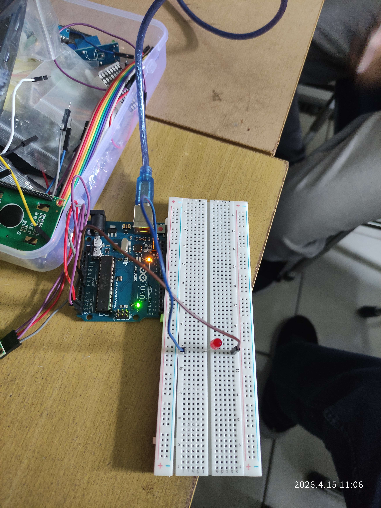
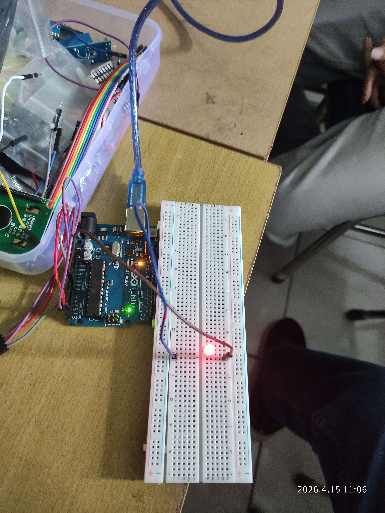
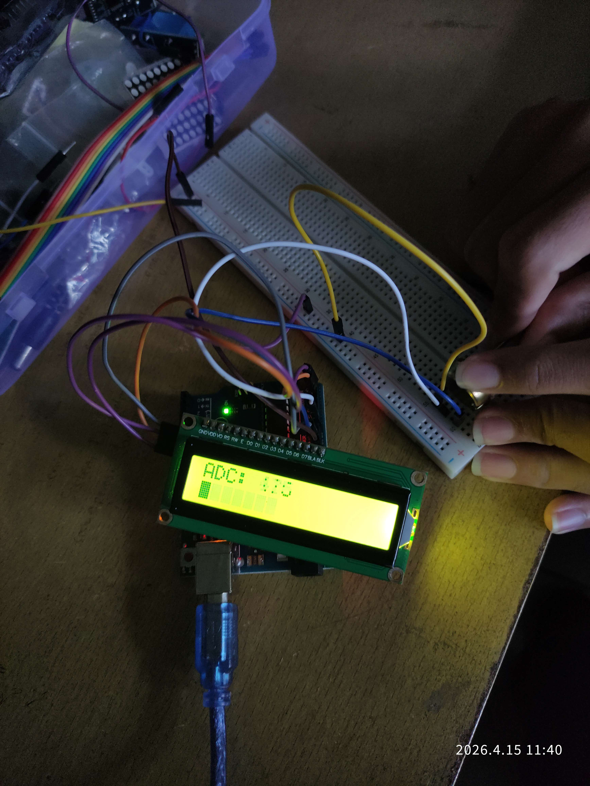
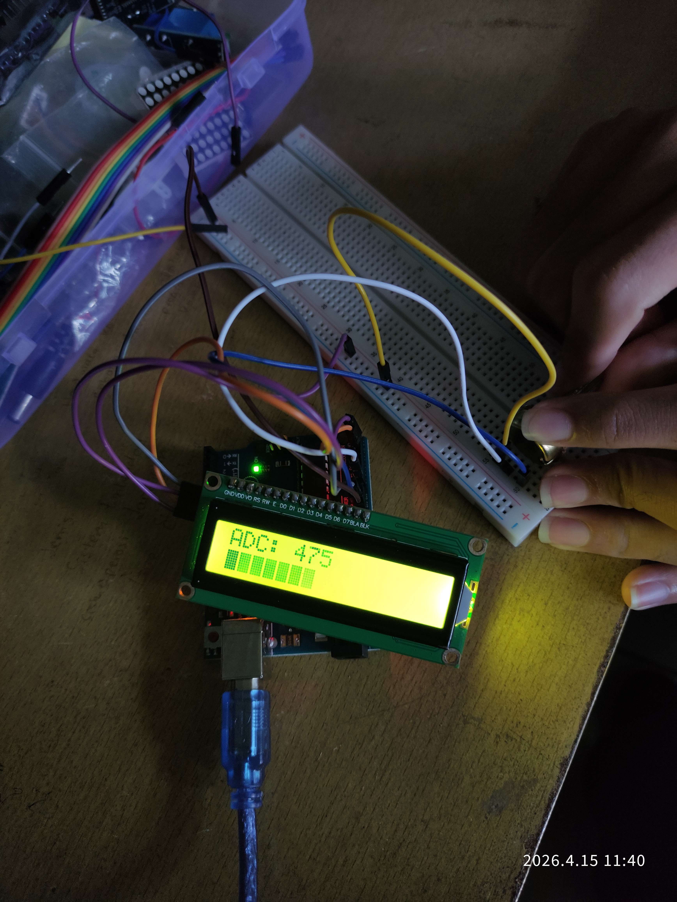

# Pertemuan 2

> Pertanyaan

## 3.5.4 Percobaan 3A: Komunikasi Serial (UART)

1. Jelaskan proses dari input keyboard hingga LED menyala/mati!

> Memasukan perintah dengan menggunakan keyboard pada Serial monitor yang selanjutnya akan diterima oleh mikrokontroler melalui kabel USB menuju pin RX menggunakan komunikasi UART. Mikrokontroler membaca data asinkron tersebut secara bit per bit berdasarkan baudrate. Perintah `Serial.read()` digunakan untuk menarik data tersebut yang kemudian pada logika programnya terdapat block `if` yang akan melakukan perbandingan, apakah data tersebut '1' yang mana akan menyalakan LED atau '0' yang justru akan mematikan LED atau bisa juga datanya malah char kosong.

2. Mengapa digunakan Serial.available() sebelum membaca data? Apa yang terjadi jika baris tersebut dihilangkan?

> Fungsi `Serial.available()` digunakan untuk mengecek apakah data masuk di buffer memori serial. Jika baris tersebut dihilangkan maka saat `Serial.read()` akan selalu tereksekusi walaupun tidak ada data yang diinputkan. Ini juga memicu kesalahan pada logika karena data yang masuk bisa saja null atau -1.

3. Modifikasi program agar LED berkedip (blink) ketika menerima input '2' dengan kondisi jika ‘2’ aktif maka LED akan terus berkedip sampai perintah selanjutnya diberikan!

```c++
const int PIN_LED = 12; // Pin LED

char curCommand = '0'; // Penampung perintah saat ini
unsigned long prevMillis = 0; // Penampung waktu saat ini

void setup() { // Fungsi yang akan dijalankan sekali pada saat Arduino pertama kali dinyalakan
  Serial.begin(9600); // Menginisiasi komunikasi UART dengan baudrate 9600
  Serial.println("Ketik '2' BLINK, '1' ON, '0' OFF"); // Menampilkan pesan pada serial
  pinMode(PIN_LED, OUTPUT); // Menginisiasi pin LED sebagai output
}

void loop() { // Fungsi yang akan di jalankan secara terus menerus
  if(Serial.available() > 0) { // Mengecek apakah ada data yang masuk ke mikrokontroler
    char data = Serial.read(); // Membaca 1 karakter

    if (data == '\n' || data == '\r') { // Memastikan bahwa karakter yang di input bukan merupakan newline
        Serial.println("Perintah tidak dikenali");
    } else { // Masuk ke block ini jika bukan karakter newline
        curCommand = data; // Mengubah current command dengan karakter sekarang(semua karakter bisa masuk)

        if(data == '1') { // Jika input = '1', maka LED akan menyala
            digitalWrite(PIN_LED, HIGH);
            Serial.println("LED ON");
        } else if (data == '0') { // Jika input = '0', maka LED akan mati
            digitalWrite(PIN_LED, LOW);
            Serial.println("LED OFF");
        } else if (data == '2') { // Jika input = '2', maka LED akan berkedip
            Serial.println("LED BLINK");
        }
    }

  }

  if(curCommand == '2') { // Jika current command = '2', maka block kode berikut akan dijalankan
    unsigned curMillis = millis(); // Mengambil waktu sekarang

    if (curMillis - prevMillis >= 500) { // Mengecek apakah waktu sebelumnya dengan sekarang lebih besar dari 500(interval berkedip)
        prevMillis = curMillis; // Mengubah current millis menjadi waktu sekarang

        digitalWrite(PIN_LED, !digitalRead(PIN_LED)); // Mematikan dan menyalakan LED
    }
  }
}
```

4. Tentukan apakah menggunakan delay() atau milis()! Jelaskan pengaruhnya terhadap sistem!

> Pada sistem ini digunakan fungsi `millis()`. Jika menggunakan delay, program akan terkena blocking saat delay dijalankan yang akan mengakibatkan mikrokontroler tidak responsif karena sedang terhenti sesaat yang artinya program perlu menunggu hingga jeda delay sebelum melanjutkan perintah selanjutnya. Dengan menggunakan millis, mikrokontroler akan berjalan secara non-blocking.

## 3.6.4 Percobaan 3B: Inter-Integrated Circuit (I2C)

1. Jelaskan bagaimana cara kerja komunikasi I2C antara Arduino dan LCD pada rangkaian tersebut!

> Komunikasi I2C menggunakan jalur komunikasi bus yang terdiri dari 2 buah pin, SDA untuk transfer data dan SCL untuk clock. Instruksi dari Mikrokontroler masuk secara spesifik ke LCD dengan memanggil alamat I2C dari LCD tersebut.

2. Apakah pin potensiometer harus seperti itu? Jelaskan apa yang terjadi apabila pin kiri dan pin kanan tertukar!

> Tidak masalah jika pin tersebut di tukar, kita boleh saja menukarnya. Saat pin kiri dan kanan potensiometer ditukar, potensio tetap bekerja normal, hanya saja arah putaran potensionya akan terbalik. Misal jika sebelum di balik, jika di putar searah jarum jam nilai resistansinya akan menurun. Maka setelah di balik nilainya malah akan bertambah jika diputar searah jarum jam.

3. Modifikasi program tersebut dengan menghubungkan antara UART dan I2C (keduanya sebagai output) sehingga:<br/> - Data tidak hanya di tampilkan di LCD tetapi juga di Serial Monitor<br /> - Adapun data yang ditampilkan pada Serial Monitor sesuai dengan tabel berikut:<br />

   | ADC: 0 | Volt: 0.00V | Persen: 0% |
   | ------ | ----------- | ---------- |

   <br />- ADC: 0 0% | setCursor(0, 0) dan Bar (level) | setCursor(0, 1)

```c++
#include <Wire.h>
#include <LiquidCrystal_I2C.h>

LiquidCrystal_I2C lcd(0x27, 16, 2); // Menginisiasi object LCD dengan alamat 0x27 dengan panjang 16 baris dan lebar 2 kolom

const int pinPot = A0; // pin potensio

void setup() { // Fungsi yang akan dijalankan sekali pada saat Arduino pertama kali dinyalakan
  Serial.begin(9600);

  lcd.init(); // Menyiapkan LCD
  lcd.backlight(); // Menyalakan backlight LCD
}

void loop() { // Fungsi yang akan di jalankan secara terus menerus
  int nilai  = analogRead(pinPot); // Membaca nilai dari potensiometer

  int panjangBar = map(nilai, 0, 1023, 0, 16); // Menghitung panjang bar untuk dari rasio perbandingan var nilai(0-1023) menjadi kisaran (0-16)
  int persen = map(nilai, 0, 1023, 0, 100); // Menghitung persentase dari volt, rasio perbandingan var nilai(0-1023) menjadi persentase(0-100)
  float volt = (nilai / 1023.0) * 5.0; // Menghitung tegangan

  // Menampilkan data ke Serial
  Serial.print("ADC: ");
  Serial.print(nilai);
  Serial.print(" | Volt: ");
  Serial.print(volt);
  Serial.print(" | Persen: ");
  Serial.print(persen);
  Serial.println("%");

  // Menampilkan data ke LCD
  lcd.setCursor(0,0);
  lcd.print("ADC: ");
  lcd.print(nilai);
  lcd.print(" ");
  lcd.print(persen);
  lcd.print("%");
  lcd.print("     ");

  // Menampilkan bar persentase volt pada LCD
  lcd.setCursor(0, 1);
  for(int i = 0; i < 16; i++) {
    if(i < panjangBar) {
      lcd.print((char)255);
    } else {
      lcd.print("	");
    }
  }

  delay(200);
}
```

4. Lengkapi tabel berikut berdasarkan pengamatan pada Serial Monitor

> [!NOTE]
> Potensiometer 1K ohm

| ADC | Volt (V) | Persen (%) |
| --- | -------- | ---------- |
| 1   | 0.00     | 0%         |
| 21  | 0.10     | 2%         |
| 49  | 0.23     | 4%         |
| 74  | 0.35     | 7%         |
| 96  | 0.46     | 9%         |

# Dokumentasi

1. Percobaan 3A: Komunikasi Serial (UART)




2. Percobaan 3B: Inter-Integrated Circuit (I2C)




[Video dokumentasi I2C](dokumentasi-i2c_2.mp4)
