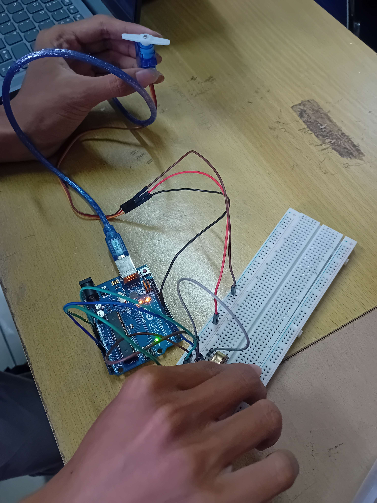

# Pertemuan 4

> Pertanyaan

## Percobaan 4A: Analog to Digital Converter (ADC)

- Apa fungsi perintah analogRead() pada rangkaian praktikum ini?

> Fungsi `analogRead()` digunakan untuk membaca tegangan analog dari pin input (misalnya potensiometer) dan mengonversinya menjadi nilai digital melalui ADC internal Arduino. Nilai yang dihasilkan berada pada rentang 0–1023 sesuai dengan resolusi 10-bit.

- Mengapa diperlukan fungsi map() dalam program tersebut?

> Fungsi `map()` digunakan untuk mengubah rentang nilai tertentu ke rentang nilai lain tanpa mengubah proporsinya. Dalam konteks ini, nilai ADC (0–1023) dipetakan menjadi sudut servo (misalnya 0–180°), sehingga pergerakan servo sesuai dengan perubahan nilai potensiometer.

- Modifikasi program berikut agar servo hanya bergerak dalam rentang 30° hingga 150°, meskipun potensiometer tetap memiliki rentang ADC 0–1023.

```cpp
#include <Servo.h>

Servo myservo;

const int potensioPin = A0;
const int servoPin = 9;

int pos = 0;
int val = 0;

void setup() {
  myservo.attach(servoPin);
  Serial.begin(9600);
}

void loop() {
  val = analogRead(potensioPin);

  pos = map(val,
            0,    // min ADC
            1023, // max ADC
            30,    // sudut min
            150   // sudut max
  );

  myservo.write(pos);

  Serial.print("ADC Potensio: ");
  Serial.print(val);

  Serial.print(" | Sudut Servo: ");
  Serial.println(pos);

  delay(100);
}
```

## Percobaan 4B: Pulse Width Modulation (PWM)

- Jelaskan mengapa LED dapat diatur kecerahannya menggunakan fungsi analogWrite()!

> LED dapat diatur kecerahannya menggunakan fungsi `analogWrite()` karena Arduino menghasilkan sinyal PWM (Pulse Width Modulation), yaitu sinyal digital yang dinyalakan dan dimatikan dengan cepat. Dengan mengatur duty cycle (lama sinyal HIGH dibanding total periode), LED tampak memiliki tingkat kecerahan berbeda. Jadi, yang dihasilkan bukan tegangan analog murni, melainkan simulasi analog melalui sinyal digital.

- Apa hubungan antara nilai ADC (0–1023) dan nilai PWM (0–255)?

> Nilai ADC (0–1023) memiliki resolusi 10-bit, sedangkan nilai PWM pada Arduino memiliki resolusi 8-bit (0–255). Oleh karena itu, nilai ADC biasanya dikonversi menggunakan fungsi map() agar sesuai dengan rentang PWM. Proses ini mempertahankan proporsi nilai sehingga perubahan input analog tetap berbanding lurus dengan output PWM.

- Modifikasilah program berikut agar LED hanya menyala pada rentang kecerahan sedang, yaitu hanya ketika nilai PWM berada pada rentang 50 sampai 200.

```cpp
#include <Arduino.h>

const int potPin = A0;
const int ledPin = 9;

int nilaiADC = 0;
int pwm = 0;

void setup() {
  pinMode(ledPin, OUTPUT);
  Serial.begin(9600);
}

void loop() {
  nilaiADC = analogRead(potPin);

  pwm = map(nilaiADC,
            0,     // ADC min
            1023,  // ADC max
            0,     // PWM min
            255    // PWM max
  );

  if (pwm >= 50 && pwm <= 200) analogWrite(ledPin, pwm);
  else analogWrite(ledPin, 0);

  Serial.print("ADC: ");
  Serial.print(nilaiADC);

  Serial.print(" | PWM: ");
  Serial.println(pwm);

  delay(50);
}
```

## Dokumentasi

1. Percobaan 4A: Analog to Digital Converter (ADC)


[Video Dokumentasi ADC](dokumentasi_adc.mp4)

2. Percobaan 4B: Pulse Width Modulation (PWM)


[Video Dokumentasi PWM](dokumentasi_pwm.mp4)
