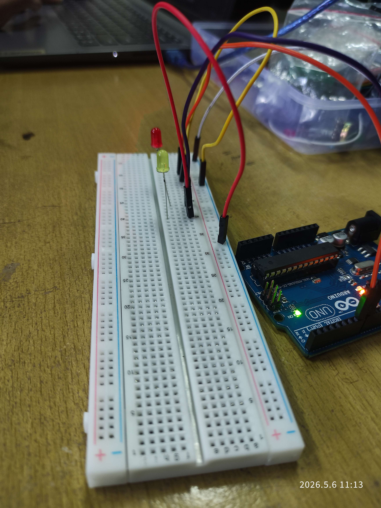
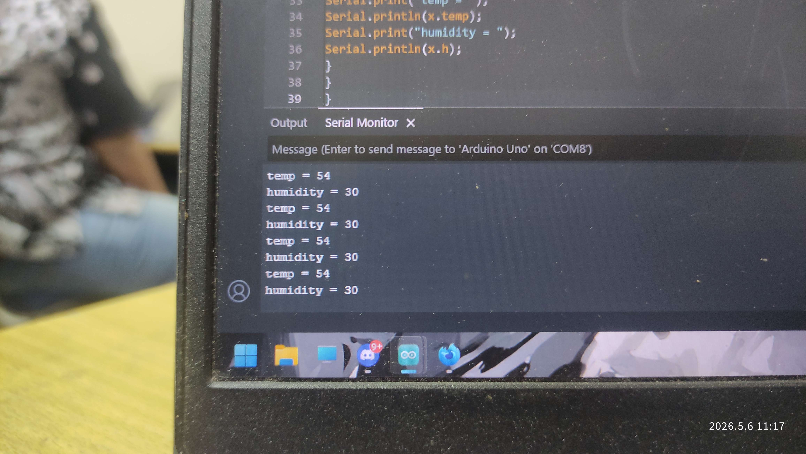

# Pertemuan 5

> Pertanyaan

## Percobaan 5A: Multitasking

1. Apakah ketiga task berjalan secara bersamaan atau bergantian? Jelaskan mekanismenya!

> Pada program seperti terlihat berjalan secara bersamaan tetapi sebenarnya bergantian oleh scheduler RTOS secara cepat. Mekanisme ini disebut multitasking concurrent. Scheduler pada FreeRTOS akan mengatur kapan setiap task mendapat giliran menggunakan CPU. Pada program tersebut terdapat tiga task yaitu `TaskBlink1`, `TaskBlink2`, dan `Taskprint`. Ketiganya memiliki prioritas yang sama yaitu 1, sehingga scheduler menjalankan task menggunakan metode time slicing atau pembagian waktu eksekusi secara bergiliran. Saat suatu task menjalankan `vTaskDelay()`, task tersebut masuk ke kondisi blocked atau menunggu sehingga CPU dapat digunakan oleh task lain. Karena delay setiap task berbeda, output serial monitor terlihat berjalan bersamaan dan LED berkedip dengan pola berbeda. Jadi, task tidak benar-benar berjalan paralel seperti pada prosesor multicore, tetapi dijalankan secara bergantian dengan sangat cepat sehingga tampak simultan.

2. Bagaimana cara menambahkan task keempat? Jelaskan langkahnya!

> Untuk menambahkan task keempat, kita bisa lakukan dengan beberapa langkah. Pertama, buat dulu function untuk task keempatnya tambahkan juga prototipe functionnya di atas, agar tetap dapat dipanggil walaupun kode fungsi utamanya ada di bawah. Kedua, daftarkan fungsi tersebut pada `setup()` dengan perintah `xTaskCreate(function, nama_task, alokasi_word, pvParameter, proritas)`

3. Modifikasilah program dengan menambahkan sensor (misalnya potensiometer), lalu gunakan nilainya untuk mengontrol kecepatan LED! Bagaimana hasilnya? Jelaskan program!

```cpp
#include <Arduino_FreeRTOS.h>
void TaskBlink1(void *pvParameters);
void TaskBlink2(void *pvParameters);
void Taskprint(void *pvParameters);
void TaskPot(void *pvParameters);

int potValue = 0;
int delayTime = 200;

void setup() {
    Serial.begin(9600);
    xTaskCreate(TaskBlink1, "task1", 128, NULL, 1, NULL);
    xTaskCreate(TaskBlink2, "task2", 128, NULL, 1, NULL);
    xTaskCreate(Taskprint, "task3", 128, NULL, 1, NULL);
    xTaskCreate(TaskPot, "task4", 128, NULL, 1, NULL);
    vTaskStartScheduler();
}
void loop() {}

void TaskBlink1(void *pvParameters) {
    pinMode(8, OUTPUT);
    while (1) {
        Serial.println("Task1");
        digitalWrite(8, HIGH);
        vTaskDelay(200 / portTICK_PERIOD_MS);
        digitalWrite(8, LOW);
        vTaskDelay(delayTime / portTICK_PERIOD_MS);
    }
}

void TaskBlink2(void *pvParameters) {
    pinMode(7, OUTPUT);
    while (1) {
        Serial.println("Task2");
        digitalWrite(7, HIGH);
        vTaskDelay(200 / portTICK_PERIOD_MS);
        digitalWrite(7, LOW);
        vTaskDelay(2 * delayTime / portTICK_PERIOD_MS);
    }
}

void Taskprint(void *pvParameters) {
    int counter = 0;
    while (1) {
        counter++;
        Serial.println(counter);
        Serial.println(delayTime);
        vTaskDelay(500 / portTICK_PERIOD_MS);
    }
}

void TaskPot(void *pvParameters) {
  while(1) {
    potValue = analogRead(A0);

    delayTime = map(potValue, 0, 1023, 100, 1000);

    vTaskDelay(100 / portTICK_PERIOD_MS);
  }
}
```

> Hasilnya, delay dari LED akan mengikuti nilai dari potensio yaitu antara 100ms sampai 1000ms. LED akan bergantian menyala, sesuai dengan nilai potensionya. Nyala LED tetap 200ms tetapi delay antar nyalanya yang akan mengikuti dari potensionya

## Percobaan 5B: Komunikasi Task

1. Apakah kedua task berjalan bersamaan atau bergantian? Jelaskan mekanismenya!

> Kedua task berjalan secara concurrent atau seolah-olah bersamaan, tetapi sebenarnya dieksekusi secara bergantian oleh scheduler FreeRTOS. Scheduler akan mengatur pembagian waktu CPU kepada setiap task. <br /><br />Task pertama yaitu read_data bertugas mengirim data ke queue menggunakan `xQueueSend()`, sedangkan task kedua yaitu display menerima data dari queue menggunakan `xQueueReceive()`. <br /><br />Saat task pengirim selesai mengirim data atau menjalankan `vTaskDelay()`, scheduler memberikan kesempatan kepada task penerima untuk berjalan. Karena pergantian eksekusi berlangsung sangat cepat, proses pengiriman dan penerimaan data terlihat berjalan bersamaan.<br /><br />Mekanisme queue pada FreeRTOS juga membantu sinkronisasi antar task sehingga komunikasi data dapat dilakukan secara aman dan teratur.

2. Apakah program ini berpotensi mengalami race condition? Jelaskan!

> Program ini memiliki kemungkinan race condition yang sangat kecil karena komunikasi data dilakukan menggunakan queue FreeRTOS.<br /><br />Race condition biasanya terjadi ketika dua atau lebih task mengakses variabel yang sama secara bersamaan tanpa mekanisme sinkronisasi. Namun pada program ini:<br /><br />- Data dikirim menggunakan `xQueueSend()`.<br />- Data diterima menggunakan `xQueueReceive()`.<br /><br />Queue FreeRTOS sudah memiliki mekanisme sinkronisasi internal sehingga akses data dilakukan secara aman. Data yang dikirim akan disalin ke dalam queue terlebih dahulu sebelum diterima oleh task lain.<br /><br />Karena itu, task pengirim dan penerima tidak mengakses memori yang sama secara langsung pada waktu bersamaan. Dengan demikian program lebih aman dari race condition dibandingkan menggunakan variabel global biasa tanpa proteksi.

3. Modifikasilah program dengan menggunakan sensor DHT sesungguhnya sehingga informasi yang ditampilkan dinamis. Bagaimana hasilnya? Jelaskan program!

```cpp
#include <Arduino_FreeRTOS.h>
#include <queue.h>
#include <DHT.h>

#define DHTPIN 2
#define DHTTYPE DHT11

DHT dht(DHTPIN, DHTTYPE);

struct readings {
  float temp;
  float hum;
};

QueueHandle_t my_queue;

void read_data(void *pvParameters);
void display_data(void *pvParameters);

void setup() {
  Serial.begin(9600);

  dht.begin();

  my_queue = xQueueCreate(5, sizeof(struct readings));

  xTaskCreate(read_data, "read", 128, NULL, 1, NULL);
  xTaskCreate(display_data, "display", 128, NULL, 1, NULL);
}

void loop() {
}

void read_data(void *pvParameters) {
  struct readings data;

  while(1) {
    data.temp = dht.readTemperature();
    data.hum = dht.readHumidity();

    xQueueSend(my_queue, &data, portMAX_DELAY);

    vTaskDelay(2000 / portTICK_PERIOD_MS);
  }
}

void display_data(void *pvParameters) {
  struct readings data;

  while(1) {
    if(xQueueReceive(my_queue, &data, portMAX_DELAY) == pdPASS) {

      Serial.print("Suhu : ");
      Serial.print(data.temp);
      Serial.println(" C");

      Serial.print("Kelembaban : ");
      Serial.print(data.hum);
      Serial.println(" %");
    }
  }
}
```

> Pada modifikasi ini digunakan sensor DHT11 untuk membaca suhu dan kelembaban secara nyata. Task `read_data` membaca data sensor setiap 2 detik kemudian mengirimkannya ke queue. Setelah itu task `display_data` menerima data dari queue dan menampilkannya pada serial monitor.<br /><br />Hasil yang diperoleh bersifat dinamis karena nilai suhu dan kelembaban berubah mengikuti kondisi lingkungan sekitar. Queue FreeRTOS memungkinkan komunikasi antar task berjalan aman dan terstruktur tanpa konflik data.<br /><br />Penggunaan multitasking membuat pembacaan sensor dan penampilan data dapat berjalan secara concurrent sehingga sistem menjadi lebih efisien dan responsif.

## Dokumentasi

1. Percobaan 5A: Multitasking


[Video Percobaan 5A](dokumentasi-multitasking.mp4)

2. Percobaan 5B: Komunikasi Task


[Percobaan 5B](dokumentasi-komunikasi_task.mp4)
