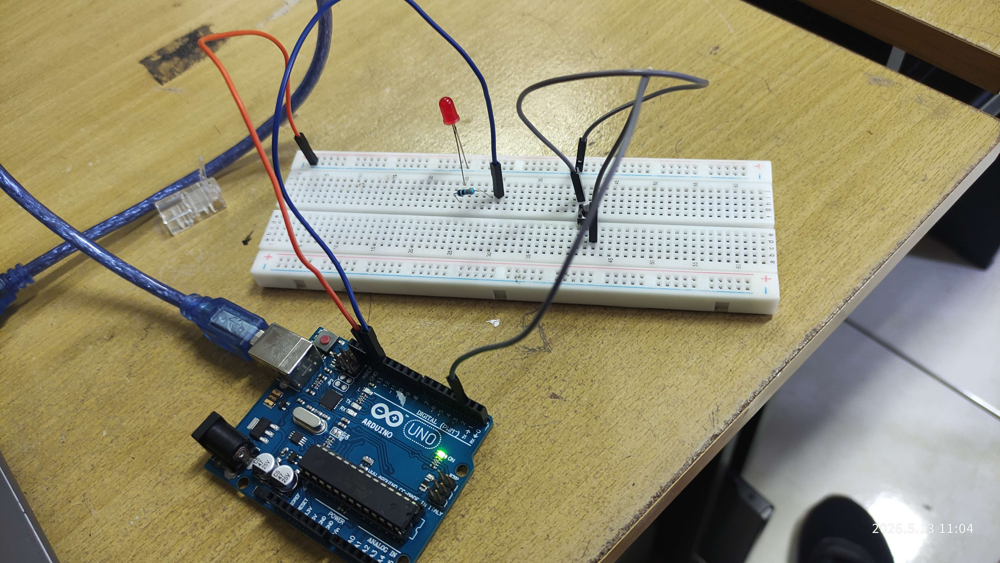
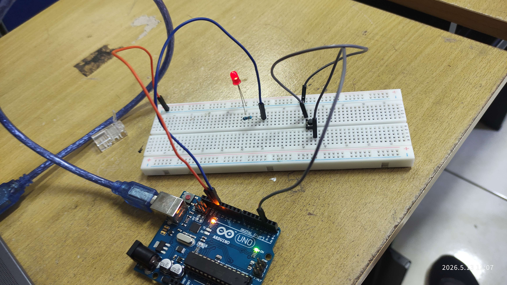

# Pertemuan 6

> Pertanyaan

## Percobaan 6A: External Interrupt

1. Jelaskan proses bagaimana tombol dapat mengubah kondisi LED menggunakan interrupt!

> Pada program percobaan, push button dihubungkan ke pin 2 Arduino yang berfungsi sebagai external interrupt. Ketika tombol ditekan, terjadi perubahan sinyal listrik pada pin tersebut dari HIGH menjadi LOW karena menggunakan mode `INPUT_PULLUP`.<br /><br />Arduino kemudian mendeteksi perubahan sinyal tersebut melalui interrupt dengan mode `FALLING`. Saat interrupt terpicu, program utama dihentikan sementara dan Arduino menjalankan fungsi ISR (`tombolInterrupt()`).<br /><br /> Di dalam ISR, nilai variabel ledState dibalik menggunakan:

```cpp
ledState = !ledState
```

> Jika sebelumnya LED mati (false), maka berubah menjadi menyala (true), begitu juga sebaliknya. Setelah ISR selesai dijalankan, program kembali ke loop() dan status LED diperbarui menggunakan:

```cpp
digitalWrite(13, ledState);
```

> Dengan mekanisme ini, Arduino tidak perlu terus-menerus mengecek tombol menggunakan polling sehingga respon menjadi lebih cepat dan efisien.

2. Apa fungsi attachInterrupt() pada program tersebut?

> Fungsi attachInterrupt() digunakan untuk menghubungkan pin interrupt dengan fungsi ISR yang akan dijalankan ketika kondisi tertentu terjadi.<br /><br />Format umum:

```cpp
attachInterrupt(digitalPinToInterrupt(pin), ISR, mode);
```

> Pada program:

```cpp
attachInterrupt(
 digitalPinToInterrupt(2),
 tombolInterrupt,
 FALLING
);
```

> Penjelasannya:<br />- digitalPinToInterrupt(2)<br />Menentukan bahwa interrupt menggunakan pin 2.<br />- tombolInterrupt<br /> Fungsi ISR yang dijalankan saat interrupt terjadi.<br />- FALLING<br />Interrupt dipicu ketika sinyal berubah dari HIGH ke LOW.<br /><br />Fungsi ini memungkinkan Arduino merespon event secara otomatis tanpa polling terus-menerus.

3. Mengapa pada ISR tidak disarankan menggunakan delay() dan Serial.print()?

> ISR harus dibuat sesingkat dan secepat mungkin karena selama ISR berjalan, program utama akan berhenti sementara. `delay()` menyebabkan mikrokontroler berhenti selama waktu tertentu. Jika digunakan di ISR maka sistem akan menjadi lambat, interrupt lain akan tertunda dan program menjadi tidak responsif. Sedangkan `Serial.print()` membutuhkan komunikasi serial yang relatif lambat dan juga bergantung pada internal interrupt. Jika digunakan di ISR akan menyebabkan buffer serial penuh, program ngefreeze atau hang dan gangguan timing pada sistem. Karena itu ISR hanya sebaiknya berisi proses ringan seperti mengubah nilai variabel atau flag.

4. Apa fungsi keyword volatile pada variabel ledState?

> Keyword `volatile` digunakan agar compiler selalu membaca nilai variabel langsung dari memori dan tidak menyimpannya dalam cache atau optimisasi register.<br /><br />Variabel `ledState` diakses oleh program utama (`loop()`) dan ISR (`tombolInterrupt()`). Karena nilainya dapat berubah sewaktu-waktu akibat interrupt, maka compiler harus selalu menggunakan nilai terbaru. Tanpa volatile, compiler dapat menganggap nilai variabel tidak berubah sehingga perubahan dari ISR mungkin tidak terbaca oleh program utama.

5. Pada percobaan digunakan mode interrupt FALLING. Modifikasikan program menggunakan mode interrupt lain (RISING, CHANGE, atau LOW) kemudian:<br />
   - Jelaskan perbedaan cara kerja masing-masing mode interrupt tersebut
   - Analisis perubahan perilaku LED yang terjadi pada setiap mode
     <br />
   1. Mode Rising

   ```cpp
    #include <Arduino.h>

    volatile bool ledState = false;

    void tombolInterrupt() {
    ledState = !ledState;
    }

    void setup() {
    pinMode(13, OUTPUT);
    pinMode(2, INPUT_PULLUP);

    attachInterrupt(
        digitalPinToInterrupt(2),
        tombolInterrupt,
        RISING
    );
    }

    void loop() {
    digitalWrite(13, ledState);
    }
   ```

   **Penjelasan**

   Mode `RISING` akan memicu interrupt ketika sinyal berubah dari LOW ke HIGH.<br /><br />

   Karena menggunakan `INPUT_PULLUP`, kondisi normal pin adalah HIGH. Saat tombol ditekan sinyal menjadi LOW, dan saat tombol dilepas sinyal kembali HIGH. Akibatnya interrupt terjadi ketika tombol dilepas.<br /><br />

   **Analisis perilaku LED**
   - LED berubah kondisi saat tombol dilepas
   - Respon sedikit terasa terlambat dibanding mode FALLING
   - Cocok digunakan ketika aksi ingin dijalankan setelah tombol selesai ditekan<br /><br />
   2. Mode Change

   ```cpp
    #include <Arduino.h>

    volatile bool ledState = false;

    void tombolInterrupt() {
    ledState = !ledState;
    }

    void setup() {
    pinMode(13, OUTPUT);
    pinMode(2, INPUT_PULLUP);

    attachInterrupt(
        digitalPinToInterrupt(2),
        tombolInterrupt,
        CHANGE
    );
    }

    void loop() {
    digitalWrite(13, ledState);
    }
   ```

   **Penjelasan**
   Mode CHANGE akan memicu interrupt setiap terjadi perubahan sinyal HIGH ke LOW atau LOW ke HIGH. Artinya interrupt terjadi dua kali yaitu saat tombol ditekan dan saat tombol dilepas<br /><br />

   **Analisis perilaku LED**
   - LED dapat berubah sangat cepat
   - Dalam satu kali tekan tombol, LED bisa toggle dua kali
   - Akibatnya LED terkadang terlihat tidak berubah karena ON lalu OFF sangat cepat
   - Mode ini sensitif terhadap bouncing tombol<br /><br />
   3. Mode Low

   ```cpp
    #include <Arduino.h>

    volatile bool ledState = false;

    void tombolInterrupt() {
    ledState = !ledState;
    }

    void setup() {
    pinMode(13, OUTPUT);
    pinMode(2, INPUT_PULLUP);

    attachInterrupt(
        digitalPinToInterrupt(2),
        tombolInterrupt,
        LOW
    );
    }

    void loop() {
    digitalWrite(13, ledState);
    }
   ```

   **Penjelasan**
   Mode LOW akan terus memicu interrupt selama pin berada pada kondisi LOW. Karena tombol dengan INPUT_PULLUP akan menjadi LOW saat ditekan, maka ISR akan dipanggil berulang kali selama tombol ditekan.<br /><br />

   **Analisis perilaku LED**
   - LED berkedip atau berubah sangat cepat saat tombol ditekan
   - Interrupt dipanggil terus-menerus
   - Penggunaan CPU menjadi lebih tinggi
   - Kurang cocok untuk toggle sederhana tanpa debounce

## Percobaan 6B: Timer

1. Jelaskan bagaimana fungsi millis() bekerja pada program tersebut!

> Fungsi millis() digunakan untuk menghitung waktu sejak Arduino pertama kali menyala dalam satuan milidetik. <br /><br />Arduino mengambil waktu saat ini lalu dibandingkan dengan waktu sebelumnya dengan`if(currentMillis - previousMillis >= interval)`.<br /><br /> Jika selisih waktunya sudah mencapai interval tertentu (misalnya 1000 ms), maka status LED dibalik, LED diperbarui dan previousMillis diisi waktu terbaru<br /><br />Dengan cara ini LED dapat berkedip berdasarkan waktu tanpa menghentikan program utama.

2. Apa perbedaan utama antara delay() dan millis()?

| delay()                    | millis()                    |
| -------------------------- | --------------------------- |
| Bersifat blocking          | Bersifat non-blocking       |
| Program berhenti sementara | Program tetap berjalan      |
| Tidak bisa multitasking    | Bisa multitasking sederhana |
| Kurang responsif           | Lebih responsif             |
| Mudah digunakan            | Sedikit lebih kompleks      |

3. Mengapa metode millis() disebut non-blocking?

> Metode millis() disebut non-blocking karena tidak menghentikan jalannya program utama. Arduino tetap menjalankan instruksi lain sambil terus memeriksa waktu secara berkala.

4. Modifikasi program agar:
   - LED pertama berkedip setiap 1 detik
   - LED kedua berkedip setiap 500 ms
   - Tanpa menggunakan delay()

```cpp
unsigned long previousMillis[2] = [0, 0]; // menyimpan millis sebelumnya
bool ledState[2] = [2]; // state dari LED

void setup() {
    // Mengatur kedua pin sebagai output
  pinMode(13, OUTPUT);
  pinMode(12, OUTPUT);
}

void loop() {
  unsigned long currentMillis = millis(); // Mengambil waktu sekarang

  if(currentMillis - previousMillis[0] >= 1000) { // mengecek jika millis sekarang dikurangi milis sebelumnya dari led 1 lebih dari 1000
    previousMillis[0] = currentMillis; // Mengeset millis menjadi waktu sekarang
    ledState[0] = !ledState[0]; // Toggling state dari led 1
    digitalWrite(13, ledState[0]); // Menyalakan / mematikan led
  }

  if(currentMillis - previousMillis[1] >= 500) { // mengecek jika millis sekarang dikurangi milis sebelumnya dari led 2 lebih dari 500
    previousMillis[1] = currentMillis; // Mengeset millis menjadi waktu sekarang
    ledState[1] = !ledState[1];  // Toggling state dari led 1
    digitalWrite(12, ledState[1]); // Menyalakan atau mematikan led
  }
}
```

## Dokumentasi

1. Percobaan 6A: External Interrupt


[Video Percobaan 6A](dokumentasi-external_interrupt.mp4)

2. Percobaan 6B: Timer


[Percobaan 6B](dokumentasi-timer.mp4)
